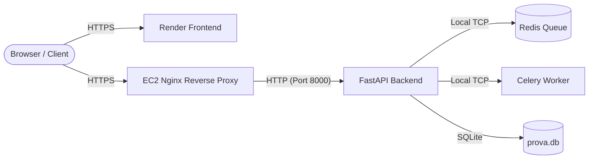

# 🚀 Deployment Guide: AWS EC2 (Backend) & Render (Frontend)

This guide walks you through deploying your **PROVA** application. To ensure a smooth deployment without **CORS errors** or **Mixed Content blocks**, the frontend (Render) and backend (EC2) must communicate securely over **HTTPS**.

---

## 🏗️ Architecture Summary



* **Frontend:** Hosted on **Render** (Static site, HTTPS by default).
* **Backend:** Hosted on **AWS EC2** (FastAPI, Redis, Celery running inside Docker, exposed securely over HTTPS).

---

## 🔒 1. How CORS & Mixed Content are Solved

1. **CORS (Cross-Origin Resource Sharing):** 
   The backend's `CORSMiddleware` in [main.py](file:///c:/Users/Afzal/Documents/FUnctional%20test-acc/Functional-Testing/python_backend/main.py) reads the environment variables `CORS_ALLOWED_ORIGINS` (comma-separated list of origins) and `CORS_ALLOWED_ORIGINS_REGEX` (regular expression). By default, it allows any subdomain of `.onrender.com` (regex `https://.*\.onrender\.com`) and standard local hostnames.
2. **Mixed Content Security:**
   Browsers block requests from an `https://` site (Render) to an insecure `http://` API (EC2 IP address). Therefore, the backend **must be served via HTTPS**. We explain how to set this up below using Nginx + Certbot (Production) or Ngrok (Staging).

---

## 🖥️ 2. Backend Deployment on AWS EC2

### Step 2.1: Launch and Configure the EC2 Instance
1. Log into your **AWS Console** and launch a new **EC2 Instance**.
   * **OS:** Ubuntu 22.04 LTS (recommended) or newer.
   * **Instance Type:** `t3.medium` or higher (recommended for running Playwright/Chromium tests).
2. Configure **Security Groups (Firewall)**. Allow the following inbound traffic rules:
   * **HTTP (Port 80):** Anywhere (`0.0.0.0/0`)
   * **HTTPS (Port 443):** Anywhere (`0.0.0.0/0`)
   * **SSH (Port 22):** Your IP address (for management)
   * *Optional (if using direct HTTP for temporary testing):* Custom TCP Port `8000` (FastAPI backend).

### Step 2.2: Setup Docker & Docker Compose
Connect to your EC2 instance via SSH:
```bash
ssh -i "your-key.pem" ubuntu@your-ec2-public-ip
```
Update packages and install Docker and Docker-Compose:
```bash
sudo apt update && sudo apt upgrade -y
sudo apt install -y docker.io docker-compose git
sudo systemctl enable docker --now
sudo usermod -aG docker ubuntu
```
> [!NOTE]
> Log out and log back in for the group permissions to take effect.

### Step 2.3: Clone Repository and Build Container
1. Clone your project code onto the EC2 instance:
   ```bash
   git clone https://github.com/afzal-sorim/Testex.git
   cd Testex
   ```
2. Create and configure your production environment file `python_backend/.env`:
   ```bash
   nano python_backend/.env
   ```
   Insert your configuration values:
   ```env
   # Backend Port & Provider Settings
   PORT=8000
   AI_PROVIDER=groq
   GROQ_API_KEY=your_groq_api_key_here
   GROQ_MODEL_NAME=llama-3.3-70b-versatile
   GEMINI_API_KEY=your_gemini_api_key_here
   GEMINI_MODEL_NAME=gemini-2.5-flash
   
   # CORS configuration
   # 1. Put your exact Render frontend URL here once deployed
   CORS_ALLOWED_ORIGINS=https://your-app-name.onrender.com
   # 2. Allow any render subdomain as backup
   CORS_ALLOWED_ORIGINS_REGEX=https://.*\.onrender\.com
   ```
3. Build and launch the backend stack using Docker Compose:
   ```bash
   docker-compose up --build -d
   ```
   This will spin up your application container containing the FastAPI server, local Redis instance, and Celery background workers.

---

## 🛡️ 3. Configuring HTTPS on AWS EC2 (Crucial)

Choose **one** of the two methods below to enable HTTPS on your EC2 instance.

### Method A: Production Setup with Nginx and Let's Encrypt (Recommended)
This method requires you to have a custom domain or subdomain (e.g. `api.yourdomain.com`) pointed to your EC2 instance's Elastic IP address.

1. **Install Nginx:**
   ```bash
   sudo apt install -y nginx
   ```
2. **Configure Nginx as a Reverse Proxy:**
   Create a server block config:
   ```bash
   sudo nano /etc/nginx/sites-available/prova-api
   ```
   Add the following configuration (replace `api.yourdomain.com` with your domain):
   ```nginx
   server {
       listen 80;
       server_name api.yourdomain.com;

       location / {
           proxy_pass http://127.0.0.1:8000;
           proxy_set_header Host $host;
           proxy_set_header X-Real-IP $remote_addr;
           proxy_set_header X-Forwarded-For $proxy_add_x_forwarded_for;
           proxy_set_header X-Forwarded-Proto $scheme;

           # WebSockets Support
           proxy_http_version 1.1;
           proxy_set_header Upgrade $http_upgrade;
           proxy_set_header Connection "upgrade";
           proxy_read_timeout 300s;
       }
   }
   ```
3. **Enable configuration and restart Nginx:**
   ```bash
   sudo ln -s /etc/nginx/sites-available/prova-api /etc/nginx/sites-enabled/
   sudo rm -f /etc/nginx/sites-enabled/default
   sudo nginx -t
   sudo systemctl restart nginx
   ```
4. **Acquire Let's Encrypt SSL Certificates via Certbot:**
   ```bash
   sudo apt install -y certbot python3-certbot-nginx
   sudo certbot --nginx -d api.yourdomain.com
   ```
   Follow the prompts. Certbot will automatically install the SSL certificates and configure Nginx to redirect HTTP to HTTPS.

---

### Method B: Staging Setup with Ngrok (Zero-Config HTTPS)
If you do not have a custom domain name and want a secure HTTPS URL immediately for testing:

1. **Install Ngrok on EC2:**
   ```bash
   curl -s https://ngrok-agent.s3.amazonaws.com/files.pub.gpg | sudo gpg --dearmor -o /usr/share/keyrings/ngrok.gpg
   echo "deb [signed-by=/usr/share/keyrings/ngrok.gpg] https://ngrok-agent.s3.amazonaws.com buster main" | sudo tee /etc/apt/sources.list.d/ngrok.list
   sudo apt update && sudo apt install ngrok -y
   ```
2. **Authenticate Ngrok:**
   Get your Authtoken from your [Ngrok Dashboard](https://dashboard.ngrok.com) and configure it:
   ```bash
   ngrok config add-authtoken <your-ngrok-authtoken>
   ```
3. **Expose FastAPI:**
   Start the tunnel on the FastAPI port `8000`:
   ```bash
   ngrok http 8000
   ```
   *(To run Ngrok in the background: `nohup ngrok http 8000 > ngrok.log 2>&1 &`)*
4. Copy the secure `https://xxxx-xx-xx-xx-xx.ngrok-free.app` URL generated by Ngrok. This will be the backend URL for your Render frontend.

---

## 🎨 4. Frontend Deployment on Render

1. Log into [Render](https://render.com) and click **New > Static Site**.
2. Link your GitHub repository.
3. Configure the static site build settings:
   * **Name:** `prova-frontend` (or any custom name)
   * **Branch:** `V2`
   * **Build Command:** `npm run build`
   * **Publish Directory:** `dist` (Vite's default build output folder)
4. Add **Environment Variables** (Click the "Advanced" button or go to the "Env Groups" / "Environment" tab):
   * **Key:** `VITE_API_URL`
   * **Value:** The HTTPS backend URL from **Method A** (e.g. `https://api.yourdomain.com`) or **Method B** (e.g. `https://xxxx.ngrok-free.app`).
5. Click **Create Static Site** to deploy.
6. Once deployed, take your frontend URL (e.g., `https://prova-frontend.onrender.com`) and add it to the EC2's `CORS_ALLOWED_ORIGINS` in your EC2 backend's `.env` file (and rebuild/restart docker containers using `docker-compose down && docker-compose up -d`).

---

## 🔍 5. Troubleshooting & Verification

* **Check Backend Logs:**
  On the EC2 instance, use:
  ```bash
  docker-compose logs -f
  ```
* **Verify CORS Preflight:**
  Open Chrome/Firefox Developer Tools (F12) -> **Network Tab** when clicking a button on the frontend. If a request fails, verify:
  * That the URL starts with `https://` (no Mixed Content).
  * That the `Access-Control-Allow-Origin` header in the response matches your Render URL exactly.
  * That your EC2 Security Groups allow incoming connections on port `80` (for Let's Encrypt verification) and `443` (for SSL traffic).
