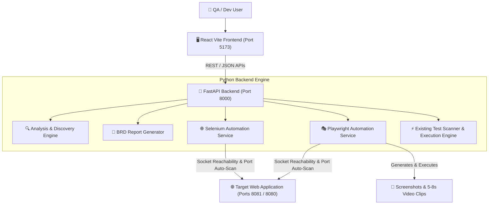

# 🧠 PROVA System Architecture & Technical Explanation

This document provides an in-depth technical explanation of the architecture, workflow pipelines, service mechanics, dynamic repository discovery engine, and test execution framework in **PROVA**.

---

## 📐 High-Level Architecture Overview

PROVA operates as a decoupled 2-tier application with an intelligent Python backend and a reactive modern React frontend:

---

## 🔍 1. Dynamic Repository Discovery Engine

The discovery engine ([analysis_service.py](file:///c:/Users/ST-Balakumaran/Desktop/PROVA/python_backend/app/services/analysis_service.py) & [domain_model_scanner.py](file:///c:/Users/ST-Balakumaran/Desktop/PROVA/python_backend/app/services/domain_model_scanner.py)) performs static and AST-like analysis over targeted codebases without assuming pre-defined module structures:

- **Entity & Domain Extraction**:
  - Scans Java classes for `@Entity`, `@Table`, JPA annotations, data fields, and controller mappings (`@RestController`, `@RequestMapping`).
  - Detects frontend components (HTML templates, JSP tags, Thymeleaf forms, React JSX pages) to discover input fields, validation rules, and button triggers.
- **Dynamic Metrics Scaling**:
  - Dynamically calculates required UI & API test scenario counts scaled to the actual number of discovered pages, routes, controllers, and database tables.
  - Ensures right-sized coverage: avoids generating bloated/redundant permutations while guaranteeing no functional modules are left uncovered.

---

## 📄 2. Business Requirement Document (BRD) Synthesis

The BRD generator ([brd_service.py](file:///c:/Users/ST-Balakumaran/Desktop/PROVA/python_backend/app/services/brd_service.py) & [brd_full_template.html](file:///c:/Users/ST-Balakumaran/Desktop/PROVA/python_backend/app/templates/brd_full_template.html)):

- Synthesizes codebase findings into executive summaries, architecture diagrams, functional rules, and component hierarchies.
- Generates polished, self-contained single-file HTML reports and PDF downloads via WeasyPrint / headless rendering.

---

## 🎭 3. Automated UI Test Execution Pipeline

### Dual Engine Support (Playwright & Selenium)
PROVA supports both **Playwright** (Node/TypeScript & Python) and **Selenium WebDriver** (Java/TestNG):

1. **Port Auto-Scan & Reachability Verification**:
   - `playwright_service.py` and `selenium_service.py` perform active socket connectivity checks (`_port_is_open(port)`).
   - If the targeted web application is running on port `8081`, `8080`, or `8082`, the service automatically detects the listening port and configures `PLAYWRIGHT_BASE_URL` / `SELENIUM_BASE_URL` accordingly, preventing `ERR_CONNECTION_REFUSED` failures.
2. **Visual Evidence & Pacing**:
   - Test generators structure distinct sub-paths (e.g. `/owners/find`, `/vets.html`, `/owners/new`), fill form inputs, scroll pages (`window.scrollBy(0, 350)`), and toggle navigation menus.
   - Includes micro-waits (`page.waitForTimeout(2500)`) so Playwright records clear 5–8 second video clips rather than 1-second blinks.

---

## ⏳ 4. Enterprise Test Lifecycle & State Management

To reflect enterprise testing standards, PROVA implements an explicit 5-stage test state machine:

$$\text{Queued} \longrightarrow \text{Running} \longrightarrow \text{Retrying (Attempt } N/3) \longrightarrow \begin{cases} \text{Passed} \\ \text{Failed} \\ \text{Skipped} \end{cases}$$

- **State Handling**:
  - Intermediate failures (e.g., waiting for element visibility or network latency) do NOT prematurely increment the final `Failed` counter.
  - The UI displays active retry attempts (`Attempt 2/3`) and locator/timeout details.
  - Only when all retry attempts exhaust does the test transition to terminal `Failed` state.

---

## 🎨 5. UI Layout & Navigation UX Design

- **Detailed Testing Strategy Modal**:
  - **Existing test cases Tab**: Renders `DYNAMIC COVERAGE ANALYSIS` and `EXISTING TEST CASE ANALYSIS` (uncovered modules, missing APIs/UI flows).
  - **Proposed test cases Tab**: Renders `COVERAGE RECOMMENDATION` (missed scenarios, covered scenarios, new coverage percentage).
- **Navigation Scroll Management**:
  - The main container (`<main ref={mainScrollRef}>` in `App.jsx`) automatically resets to `scrollTop = 0` whenever switching tabs or clicking **Continue** / **Back**, ensuring the user is always presented with the top header of the new page.

---

## 🛠️ Key File Responsibilities

| File Path | Description |
| :--- | :--- |
| [frontend/src/App.jsx](file:///c:/Users/ST-Balakumaran/Desktop/PROVA/frontend/src/App.jsx) | Root routing, state management, sidebar step wizard, and top-of-page scroll handler. |
| [frontend/src/pages/Discovery.jsx](file:///c:/Users/ST-Balakumaran/Desktop/PROVA/frontend/src/pages/Discovery.jsx) | Project Discovery page, repository tree explorer, dynamic coverage cards, and Testing Strategy modal. |
| [frontend/src/pages/ProjectRunner.jsx](file:///c:/Users/ST-Balakumaran/Desktop/PROVA/frontend/src/pages/ProjectRunner.jsx) | Live test execution suite, lifecycle state management, terminal state maps, and execution progress. |
| [frontend/src/pages/FunctionalTesting.jsx](file:///c:/Users/ST-Balakumaran/Desktop/PROVA/frontend/src/pages/FunctionalTesting.jsx) | Functional testing summary, pass/fail donut charts, execution time bar charts, and report downloads. |
| [python_backend/app/routers/api.py](file:///c:/Users/ST-Balakumaran/Desktop/PROVA/python_backend/app/routers/api.py) | Primary REST routes for repository analysis, scan, Playwright/Selenium test execution, and status polling. |
| [python_backend/app/services/playwright_service.py](file:///c:/Users/ST-Balakumaran/Desktop/PROVA/python_backend/app/services/playwright_service.py) | Playwright test generation, socket port verification, execution runner, and video artifact recording. |
| [python_backend/app/services/brd_service.py](file:///c:/Users/ST-Balakumaran/Desktop/PROVA/python_backend/app/services/brd_service.py) | Business Requirement Document HTML synthesis and PDF exporter. |
